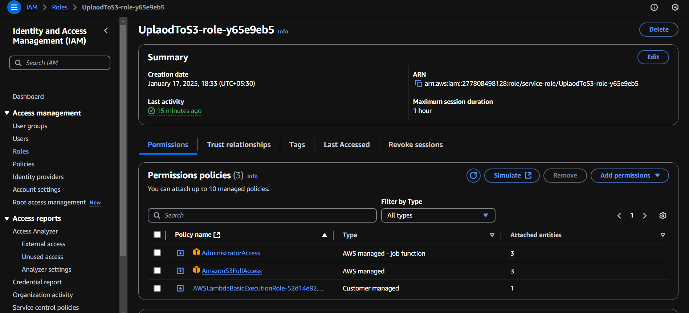

# Upload PDF to S3 Bucket using AWS Lambda (Node.js)

This project demonstrates how to create an AWS Lambda function in Node.js to upload a PDF or document file to an Amazon S3 bucket. The function decodes a Base64-encoded file and uploads it to the specified bucket. Follow the guide below to deploy and execute the project successfully.

---

## Prerequisites

Before starting, make sure you have the following tools and permissions set up:

- **AWS Account**: An active AWS account with access to IAM, Lambda, and S3 services.
- **AWS CLI**: Installed and configured with valid AWS credentials (`aws configure`).
- **Node.js**: Version 14.x or above installed locally.
- **npm**: Comes with Node.js; used for managing dependencies.
- **AWS SDK for Node.js**: Installed via npm (`npm install aws-sdk`).
- **Permissions**: An IAM role attached to the Lambda function with access to S3.

---

## Steps to Deploy and Run

### 1. Clone the Repository

Download the repository to your local machine:

```bash
git clone <repository-url>
cd <repository-folder>
```

---

### 2. Install Dependencies

Install the required dependencies for the Lambda function:

```bash
npm install
```

---

### 3. Create an S3 Bucket

To store uploaded files, create a new S3 bucket:

1. Log in to the AWS Management Console.
2. Go to the **S3** service.
3. Click **Create Bucket** and provide a unique bucket name (e.g., `pdf-upload-bucket-node`).
4. Choose a preferred AWS region.
5. Complete the setup and create the bucket.

---

### 4. Configure IAM Role

Create an IAM role that allows Lambda to write to your S3 bucket:

1. Navigate to **IAM** in the AWS Management Console.
2. Select **Roles** and click **Create Role**.
3. Choose **Lambda** as the trusted service.
4. Attach the `AmazonS3FullAccess` policy or define a custom policy like this:

```json
{
  "Version": "2012-10-17",
  "Statement": [
    {
      "Effect": "Allow",
      "Action": "s3:PutObject",
      "Resource": "arn:aws:s3:::pdf-upload-bucket-node/*"
    }
  ]
}
```



5. Save the role as `LambdaS3UploadRole` or any name you prefer.

---

### 5. Deploy the Lambda Function

#### Using AWS Console:

1. Open the **AWS Lambda Console**.
2. Click **Create Function** → **Author from Scratch**.
3. Enter a function name (e.g., `UploadPDFtoS3`).
4. Set the runtime to Node.js 14.x.
5. Attach the IAM role created earlier.
6. Paste the code from the `index.js` file (from this repository) into the inline code editor.
7. Save the function.

#### Using AWS CLI:

1. Compress the function and its dependencies into a ZIP file:

```bash
zip -r function.zip index.js node_modules
```

2. Deploy the Lambda function:

```bash
aws lambda create-function \
  --function-name UploadPDFtoS3Node \
  --runtime nodejs14.x \
  --role arn:aws:iam::ACCOUNT_ID:role/LambdaS3UploadRole \
  --handler index.handler \
  --zip-file fileb://function.zip
```

Replace `ACCOUNT_ID` with your AWS account ID.

---

### 6. Test the Function

You can test the Lambda function using a sample payload:

#### Test Event

Prepare a test event in JSON format as shown below:

```json
{
  "fileName": "example.pdf",
  "fileContent": "BASE64_ENCODED_CONTENT",
  "bucketName": "pdf-upload-bucket-node"
}
```

Replace `BASE64_ENCODED_CONTENT` with the Base64 string of your file content.

#### Test Execution:

1. Go to the **Test** tab in the Lambda Console.
2. Paste the JSON payload.
3. Execute the function by clicking **Test**.
4. Check the S3 bucket to confirm that the file has been uploaded.

---

### 7. Troubleshooting

- **Timeout Errors**: If the file upload exceeds the default timeout, increase the timeout value in the Lambda configuration under **General Configuration**.
- **Permission Denied**: Ensure the IAM role has the correct permissions to access the specified S3 bucket.
- **Invalid File Name**: Ensure the file name is valid and does not contain special characters.

---

## Cleanup

To avoid unnecessary charges, clean up the resources after testing:

1. Delete the Lambda function from the **AWS Lambda Console**.
2. Remove the files or delete the S3 bucket.
3. Delete the IAM role created for the function.

---

## License

This project is open-source under the MIT License.
